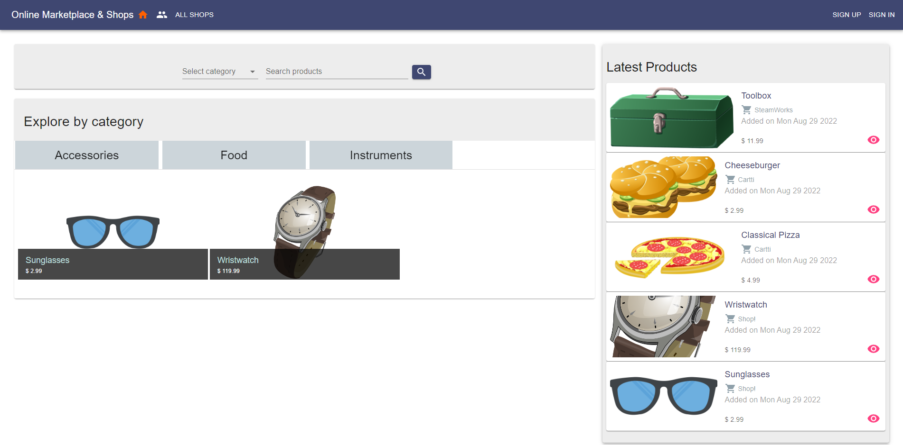

<div align="center">

# Marketplace & Shops



'Online Marketplace & Shop' is a fullstack project written with MERN stack and TypeScript. This is my first fullstack project I have ever done!
The purpose of this project was to learn about building a fullstack web application, as well as designing backend and frontend parts to coordinate with each other. I have drastically improved my vision of understanding how to create web applications! However, there is so much more to learn!

The project is in active development and I am implementing more API endpoints as well as extending the UI.

[About](#about) •
[Demo](#demo) •
[Installation](#installation) •
[Endpoints](#endpoints) •
[Author](#author) •
[License](#license)

</div>

## About

The project consists of:

1. Frontend:

- React.js (17+)
- React Router (6+)
- Material-UI (5+)

2. Backend:

- Node.js (16+)
- Express.js (4.17+)
- MongoDB(mongoose 6+)

Additionally, 'Jest' and 'mongodb-memory-server' are used for testing. 'JWTs' are used for authentication, and 'cookies' are used for authorization.

## Demo

- Frontend: [Online Shop](https://fullstack-online-shop.netlify.app/) - (Test User profile: test@user.com / testuser)
- Backend: [User Collection Example](https://backend-online-shop-sla686.herokuapp.com/api/v1/users)

## Installation

1. After succesfull cloning of the repo, change the current working directory to /api or /client side:

```sh
  cd /api
```

OR

```sh
  cd /client
```

2. Install node modules

```sh
  npm install
```

3. **_For /api folder only:_** Create '/api/.env' file with your enivronmental variables. Use '/api/.env.example' file as a template!

4. **_For /client folder only:_** In each component and helper verify the URL you would like to use for backend (later I'm planning to use .env to simplify)

5. Start the project in development mode

- For /api

```sh
  npm run start:dev
```

- For /client

```sh
  npm run start
```

6. Testing (husky will also automatically execute the following command on commit)

- For both /api and /client

```sh
  npm run test
```

7. If you wish to build the project and then start it:

- For /api

```sh
npm run build
npm run start
```

- For /client execute the following command and then host the /client/build folder by any means:

```sh
npm run build
```

## Endpoints

### Do not require authentication and authorization

#### Users

- GET /api/v1/users - lists all users
- POST /api/v1/users - creates a new user

#### Shops

- GET /api/v1/shops - lists all shops
- GET /api/v1/shops/:shopId - returns information about the specified shop
- GET /api/v1/shops/logo/:shopId - returns logo of the specified shop

#### Products

- GET /api/v1/products/latest - lists the last added products
- GET /api/v1/products/related/:productId - lists the related products from the same category
- GET /api/v1/products/categories - lists categories
- GET /api/v1/products - lists the products
- GET /api/v1/products/:productId - returns information about the specified product
- GET /api/v1/products/image/:productId - returns an image of the product
- GET /api/v1/products/by/:shopId - returns an array of products offered by the specified shop

#### Authentication/Authorization

- POST /api/v1/signin - authentication sign in
- GET /api/v1/signout - authentication sign out

### Require authentication (token) and authorization

#### Users

- GET /api/v1/users/:userId - returns information about the specified user
- PATCH /api/v1/users/:userId - updates the specified user
- DELETE /api/v1/users/:userId - deletes the specified user

#### Shops

- POST /api/v1/shops/by/:userId - creates a new shop
- GET /api/v1/shops/by/:userId - lists shops belonging to the user
- PATCH /api/v1/shops/:shopId - updated the specified shop
- DELETE /api/v1/shops/:shopId - deletes the specified shop

#### Products

- POST /api/v1/products/by/:shopId - creates a product for the specified shop
- PATCH /api/v1/products/:shopId/:productId - updates the specified product
- DELETE /api/v1/products/:shopId/:productId - deletes the specified product

## Author

- LinkedIn: [Viacheslav Semushin](https://www.linkedin.com/in/viacheslav-semushin/)
- Github: [@sla686](https://github.com/sla686)

## License

Copyright © 2022 [@sla686](https://github.com/sla686) </br>
